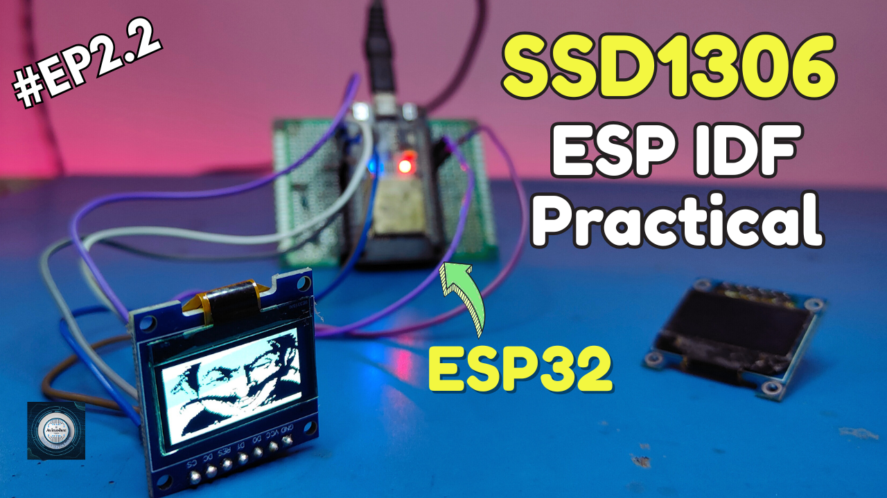

<h1 align="center">
  <a href="https://www.youtube.com/@eccentric_engineer">
	
  </a>  
</h1>

<h3 align="center">
	Minimal SSD1306 Graphics Driver for ESP32
</h3>


  
## 📝 Overview

This repository provides a platform-independent driver for the SSD1306 OLED display controller available in the SSD1306_OLED_common/
folder, tailored for ESP32 using ESP-IDF.
The implementation focuses on delivering a clean, modular, and reusable codebase that can serve as a foundation for simple graphics rendering and advanced GUI integrations.

The driver supports basic pixel-level drawing, and buffer management at the moment. It is designed with portability in mind, 
making it easier to adapt the same code structure for other platforms (such as STM32 or different MCUs) without major changes.

This project represents the first stage of the SSD1306 + ESP32 integration: building a standalone driver.
Future work includes adding LVGL support and expanding higher-level graphics functionality.

Reference taken from Adafruit SSD1306 library - https://github.com/adafruit/Adafruit_SSD1306  
Platform used for firmware development is ESP-IDF v5.0.6 on VSCode.  
Learn more about this series 👇👇  
  
Part 1 👇  
[](https://youtu.be/BN-J8Ks-_c4)  

Part 2.1 👇  
[](https://youtu.be/xIpSNDCL8Ik)  

Part 2.2 👇  
[](https://youtu.be/Z6mqr9_zbDc)  

  
## ✔️ Requirements

### 📦 Hardware
- ESP32 Devkit V1 (main controller  board)
- USB Micro Cable
- SSD1306 Oled Display Module
- Jumper Cables 

### 📂 Software
- VSCode (https://code.visualstudio.com/)  
- ESP-IDF (https://docs.espressif.com/projects/vscode-esp-idf-extension/en/latest/installation.html)

## 🛠️ Installation and usage

```sh
git clone https://github.com/AvinasheeTech/esp32-ssd1306-idf-driver.git
Open project in VSCode
Go to ESP-IDF explorer icon in the left side panel -> Select Open ESP-IDF Terminal
Enter command 'idf.py set-target x' to select correct chip. Example - For ESP32 DevKit V1
replace x with esp32. for ESP32-C6 DevKitC-1, replace x with esp32c6 and so on. 
Enter the command 'idf.py build' to build the firmware.
Next connect ESP32 device to PC and confirm the COM port available.
Run the command 'idf.py -p PORT flash' where PORT is COMx with x being a number, to flash the firmware.
Connect your SSD1306 oled module to the spi pins mentioned in code. 
Enjoy...🍹
```
To learn more about how to upload code to ESP32 using VSCode, click link below 👇👇  

[](https://youtu.be/aKiBNeOgbLA)


## ⭐️ Show Your Support

If you find this helpful or interesting, please consider giving us a star on GitHub. Your support helps promote the project and lets others know that it's worth checking out. 

Thank you for your support! 🌟

[](https://github.com/AvinasheeTech/esp32-ssd1306-idf-driver/stargazers)
